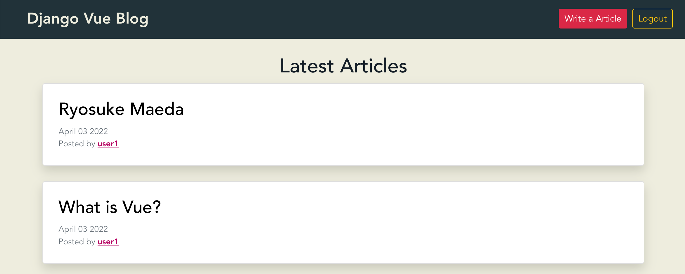

# Django Vue.js Blog

## 概要

Django REST FrameworkとVue.jsを使ったブログサイトのSingle Page Applicationです！  
`docker-compose up` のコマンド1つで、開発用サーバとデータベース用のdockerコンテナを自動で生成し、  
サンプルデータの挿入まで行います。  
ナビゲーションバーの「Write a Article」ボタンを選択すると、新しいブログ記事を記入することができます。  
メインのページから任意のブログのタイトルを選択すると、その詳細ページに移動し、  
コメントの記入・編集・削除や、他のユーザのコメントに"Like"することができます。  
また、メイン画面で確認できる記事のユーザ名を選択すると、その選択したユーザが投稿した記事のみを表示します。  


## アプリキャプチャ



## 始め方

### 1. Dockerのセットアップ

Docker Desktopのダウンロード & インストール  
https://www.docker.com/products/docker-desktop/

### 2. プロジェクトのダウンロード

```shell
git clone https://github.com/ryo-keima/django-vue-blog.git
cd django-vue-blog
```

### 3. サーバーの起動

```shell
docker-compose up 
```

### 4. ブラウザで表示

ブラウザで下記URLにアクセスします。  
`http://127.0.0.1:8000/`

### 5. ログイン

下記アカウントでログインできます。
```shell
Username: admin
Password: adminpass
```

### 6. サーバの停止

「Ctrl + C」で停止します。
